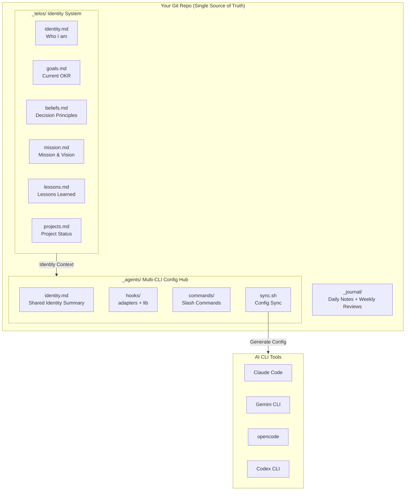
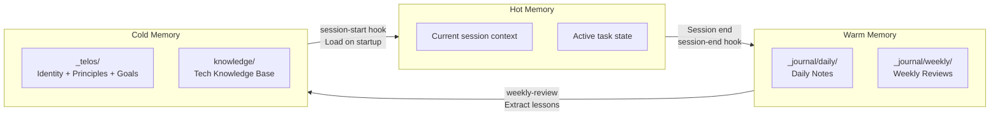
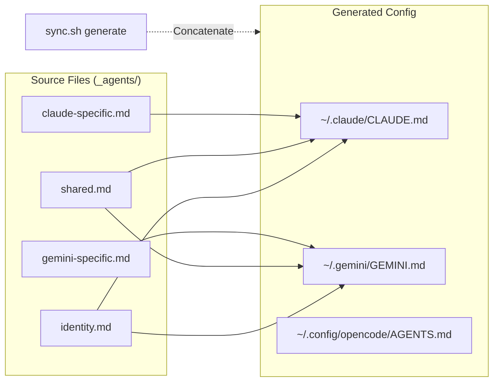
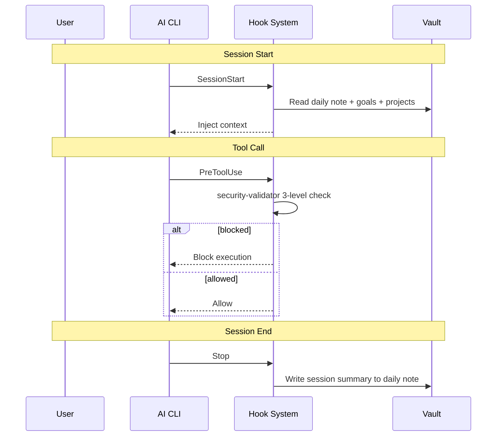

[中文](README.zh-CN.md) | English

# telos — Personal AI Identity System

> A structured framework for maintaining consistent AI assistant behavior across multiple CLI tools.

## What is telos?

telos is a personal AI infrastructure template built on top of an Obsidian vault (or any plain-text folder). It gives your AI CLI tools — Claude Code, Gemini CLI, opencode, Codex CLI, and Kimi — persistent context about who you are, what you're working on, and how you make decisions.

**Before telos:** Every AI conversation starts from zero. You repeat your goals, explain your projects, and re-state your preferences every single session.

**After telos:** Your AI knows your identity, goals, active projects, decision principles, and lessons learned. Context loads automatically at session start, so you pick up right where you left off.

The core idea is simple: AI shouldn't be stateless. Your time and context are valuable. telos turns your AI CLI from a generic tool into a partner that understands your world.

## Design Philosophy

Built on the PAI (Personal AI Infrastructure) methodology, implemented with Obsidian + Git + Shell scripts:

1. **Single source of truth** — One Git repo = Obsidian vault = AI config hub
2. **Identity as configuration** — Your role, decision principles are not scattered notes, but system instructions loaded every time AI starts
3. **Layered memory** — Hot/Warm/Cold three-layer memory with different lifecycles and sedimentation mechanisms
4. **Multi-CLI unification** — One set of source files, sync.sh generates each CLI's config format
5. **Security first** — Three-level security validation intercepts dangerous operations, hard blocks on critical paths

## Features

- Identity System — persistent beliefs, goals, strategies, and mental models
- Three-Layer Memory — Hot (session) → Warm (journal) → Cold (identity), automatic sedimentation
- Session Logging — automatic daily notes and weekly reviews
- Security Guardrails — configurable command validation via hook-based security patterns
- Multi-CLI Support — Claude Code, Gemini CLI, opencode, Codex CLI, Kimi
- Multi-CLI Orchestration — telos-swarm with Arena, Brainstorm, Pair, and Free modes
- Slash Commands — daily-log, weekly-review, decision-helper, knowledge-capture, and more
- 6 Pre-installed Skills — TDD, MCP Builder, Token Efficiency, Writing Plans, Snapshot, telos-swarm
- Vault Analysis Tools — link analyzer, journal linker
- Hook System — session lifecycle, security validation, notifications

## Multi-CLI Orchestration with telos-swarm

telos-swarm coordinates multiple AI CLIs to work together on complex tasks. Instead of switching between tools manually, define a task and let agents collaborate.

### Orchestration Modes

| Mode | Description | Use Case |
|------|-------------|----------|
| Arena | Debate format: analysis → cross-review → synthesis | Comparing approaches, architecture decisions |
| Brainstorm | Collaborative ideation: analysis → synthesis | Naming, creative exploration, feature ideas |
| Pair | Driver-navigator: coding → review → revision | Implementation with built-in code review |
| Free | Custom task chains with dependency management | Complex multi-step workflows |

### Core Capabilities

- Task system with dependency chains and auto-dispatch
- Quality gates (min lines, structure validation, error detection)
- Git worktree isolation per agent
- Automatic failover on quality gate failure
- Lifecycle hooks (swarm_start, swarm_stop, task_complete, arena_complete)
- YAML-based configuration

### Quick Examples

```bash
# Arena debate between Claude and Gemini
telos-swarm arena --auto --claude --gemini "API design approach"

# Brainstorm with 3 CLIs
telos-swarm brainstorm --auto --claude --gemini --kimi "Product naming"

# Custom task chain
telos-swarm task add --type coding --assign claude "Implement auth module"
telos-swarm task add --type review --assign gemini --depends 001 "Review auth implementation"
telos-swarm task dispatch
```

## Core Systems

### TELOS Identity System (`_telos/`)

TELOS answers a fundamental question: **With what identity, principles, and goals should AI assist you?**

```
_telos/
├── identity.md      # Who you are: role, core skills, career trajectory
├── mission.md       # Mission & vision: north star direction
├── goals.md         # Current OKR: quarterly updated goals
├── beliefs.md       # Decision principles: core beliefs, AI's decision basis
├── models.md        # Mental models: commonly used models, referenced by decision-helper
├── strategies.md    # Strategies: current phase action strategies
├── projects.md      # Project status: tracking all active projects
├── worklog.md       # Work tracking: in-progress and queued items
├── lessons.md       # Lessons learned: continuously appended, weekly-review extracts
├── challenges.md    # Current challenges: periodically reviewed
└── ideas.md         # Idea inbox
```

Design logic:

- Each file focuses on a single dimension, following the atomicity principle
- Files reference each other via Obsidian `[[wikilink]]`, forming a knowledge network
- `identity.md` is the root node, other files revolve around it
- AI loads summaries at startup, reads full files on demand for deeper context

### Architecture Overview



### Three-Layer Memory System



| Layer | Storage | Lifecycle | Write Method | Read Method |
|-------|---------|-----------|-------------|-------------|
| Hot | AI session context | Single session | Natural conversation | Immediately available |
| Warm | `_journal/` daily/weekly | Day/Week | Hook auto-write + `/daily-log` | session-start loads today's note |
| Cold | `_telos/` + `knowledge/` | Long-term | `/weekly-review` extraction + manual | session-start loads summary |

### Multi-CLI Config Hub

One set of source files, auto-generated into each CLI's config format via `sync.sh`:



`sync.sh` subcommands:

| Command | Function |
|---------|----------|
| `generate` | Concatenate source files to generate each CLI's config |
| `link` | Create symlinks (skills, commands, hooks) |
| `verify` | Health check (symlink integrity, config consistency) |
| `all` | Backup → Generate → Link → Verify (one command) |

### Hook System

Hooks trigger actions at key points in the AI session lifecycle:



### Security System

`security-patterns.yaml` defines three-level security rules:

```yaml
blocked:   # Hard block, cannot bypass
  - "rm -rf /"
  - "rm -rf ~"
  - "gh repo delete"

confirm:   # Requires user confirmation
  - "git push --force"
  - "git reset --hard"

alert:     # Log warning
  - "curl|sh"
```

## Quick Start

### Prerequisites

- At least one AI CLI tool (Claude Code / Gemini CLI / opencode / Codex CLI / Kimi)
- Git
- Optional: Obsidian 1.12+ (enhances the experience, not required)

### 1. Clone

```bash
git clone https://github.com/<your-username>/telos-template.git ~/Documents/Obsidian\ Vault
cd ~/Documents/Obsidian\ Vault
```

### 2. Setup

```bash
bash setup.sh
```

The interactive setup has two phases:

- **Phase 1 (Basic config)**: Name, role, language, path, CLI selection (~1 minute)
- **Phase 2 (Identity definition)**: Title, goals, capabilities, mission, challenges, projects (optional, ~2 minutes)

Each step in Phase 2 can be skipped by pressing Enter — you can edit `_telos/` files manually later.

For automated/CI environments:

```bash
bash setup.sh --non-interactive
```
### 3. Start using

```bash
claude   # Claude Code will auto-load your telos context
gemini   # Gemini CLI picks it up too
```

## Directory Structure

```
telos-template/
├── _telos/                    # Identity system (who you are)
│   ├── identity.md            # Role, capabilities, trajectory
│   ├── mission.md             # Mission, vision, north star
│   ├── beliefs.md             # Decision principles, work style
│   ├── goals.md               # OKR-style goals
│   ├── projects.md            # Active projects list
│   ├── worklog.md             # Work in progress / done / queued
│   ├── lessons.md             # Lessons learned and root causes
│   ├── challenges.md          # Current obstacles
│   ├── strategies.md          # Action strategies
│   ├── models.md              # Mental models and frameworks
│   └── ideas.md               # Idea inbox
├── _agents/                   # AI CLI configuration
│   ├── identity.md            # Generated identity for CLIs
│   ├── instructions/          # CLI-specific instructions
│   │   ├── shared.md          # Shared across all CLIs
│   │   ├── claude-specific.md
│   │   ├── gemini-specific.md
│   │   ├── opencode-specific.md
│   │   ├── codex-specific.md
│   │   ├── kimi-specific.md
│   │   └── ...                # Optional modular instructions
│   ├── commands/              # Slash commands
│   ├── hooks/                 # Hook framework
│   │   ├── adapters/          # CLI-specific adapters
│   │   │   ├── claude/
│   │   │   ├── gemini/
│   │   │   ├── opencode/
│   │   │   └── kimi/
│   │   └── lib/               # Shared libraries
│   ├── scripts/               # Tools and orchestrator
│   │   ├── telos-swarm/       # Multi-CLI orchestrator (Arena/Brainstorm/Pair/Free)
│   │   ├── journal-link.sh
│   │   ├── link-analyzer.sh
│   │   └── link-analyzer-README.md
│   ├── skills/                # Agent skills
│   │   ├── tdd/               # Test-Driven Development
│   │   ├── mcp-builder/       # MCP server development
│   │   ├── snapshot/          # State snapshot tool
│   │   ├── telos-swarm/       # Swarm orchestration reference
│   │   ├── writing-plans/
│   │   └── token-efficiency/
│   ├── security-patterns.yaml # Security rules
│   ├── config.env             # User configuration
│   └── sync.sh                # Sync script
├── _journal/                  # Daily and weekly notes
│   ├── daily/
│   └── weekly/
├── work/                      # Work directories
│   ├── personal/
│   └── company/
├── knowledge/                 # Knowledge base
├── attachments/               # Images and files
├── setup.sh                   # Interactive setup script
├── README.md
├── .gitignore
└── LICENSE
```
## Supported AI CLIs

| CLI | Config File | Commands | Hooks | Skills |
|-----|-------------|----------|-------|--------|
| Claude Code | `~/.claude/CLAUDE.md` | .md | shell hooks | symlink |
| Gemini CLI | `~/.gemini/GEMINI.md` | .toml (auto-converted) | shell hooks | auto-discover |
| opencode | `~/.config/opencode/AGENTS.md` | .md | JS plugin | auto-discover |
| Codex CLI | `~/.codex/AGENTS.md` | — | — | symlink |
| Kimi (Experimental) | AGENTS.md (vault root) | — | — | manual (`--skills-dir`) |

## Customization

### Editing your identity

All personal context lives in `_telos/`. Edit these files directly — they're plain Markdown. After editing, run `_agents/sync.sh all` to propagate changes to your CLI configurations.

### Adding commands

Create a `.md` file in `_agents/commands/`, then run `_agents/sync.sh link` to symlink it into each CLI's command directory.

### Adding skills

Install community skills into `_agents/skills/`, then run `_agents/sync.sh link`. Skills are domain-specific extensions (TDD, architecture patterns, etc.) that you install based on your needs.

### Multi-device sync

```bash
# Deploy on a new device
git clone <your-repo> "Obsidian Vault"
cd "Obsidian Vault" && bash setup.sh
```

Use Git to sync. Recommended to pair with Obsidian's obsidian-git plugin for automatic sync.

## Included Skills

| Skill | Description | Files |
|-------|-------------|-------|
| tdd | Test-Driven Development methodology | 30+ reference docs |
| mcp-builder | MCP server development guide | 10 files |
| telos-swarm | Multi-CLI orchestration reference | 2 files |
| writing-plans | Structured planning workflow | 1 file |
| token-efficiency | Token optimization practices | 1 file |
| snapshot | State snapshot tool | 2 files |

## Design Decisions

**Why Obsidian instead of a database?** Markdown is the most durable format, no dependency on specific tools. Git version control = free time machine.

**Why separate `_agents/` and `_telos/`?** `_telos/` is content (who you are), `_agents/` is infrastructure (how to deliver to AI CLIs). Separation of concerns — changing identity doesn't require touching config.

**Why Shell for hooks?** Startup time < 100ms, zero extra dependencies, the logic is essentially "read files → concatenate strings → output".

## Philosophy

telos follows the PAI (Personal AI Infrastructure) approach:

- **Context is king.** AI without your context is just a fancy autocomplete. Your identity, goals, and lessons should persist across every session.
- **One source of truth.** Define yourself once in `_telos/`, and let `sync.sh` distribute that identity to every CLI you use.
- **Security by default.** Hooks validate commands before execution. You control what AI can and cannot do.
- **Plain text, version controlled.** Everything is Markdown and shell scripts. No databases, no cloud services, no lock-in. Git is your sync layer.

## FAQ

**Q: Do I need Obsidian?**
A: No. telos works as a plain file system. Obsidian enhances the experience with graph view, backlinks, and CLI integration, but is not required.

**Q: Can I use this without any AI CLI?**
A: The `_telos/` identity system works standalone as a personal knowledge base. The `_agents/` integration requires at least one supported AI CLI.

**Q: How do I sync across devices?**
A: Use git. The vault is a git repo. Push/pull to sync, then run `_agents/sync.sh all` on each device after pulling.

**Q: Is my data sent anywhere?**
A: No. telos is entirely local. Your identity files are read by your local AI CLI tools. Nothing is uploaded or shared unless you push to a remote git repository.

## License

MIT
