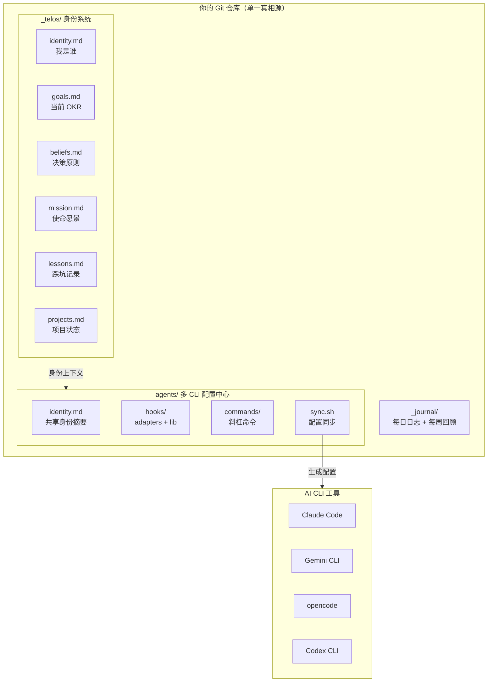
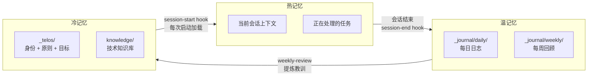
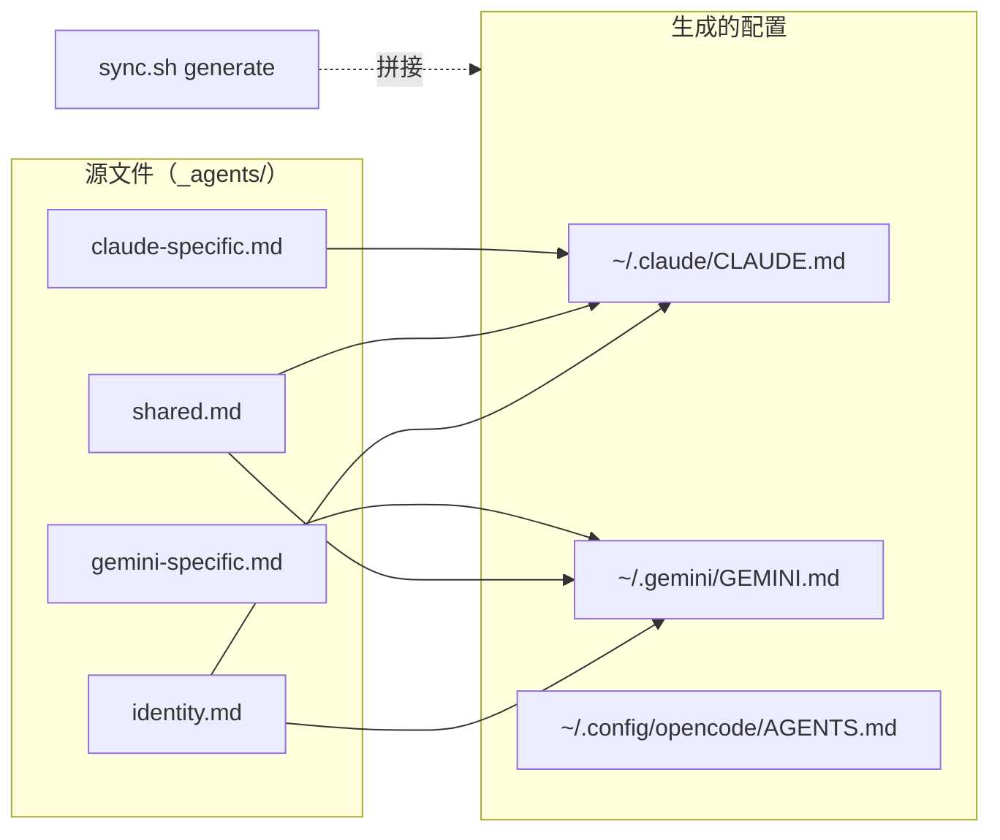
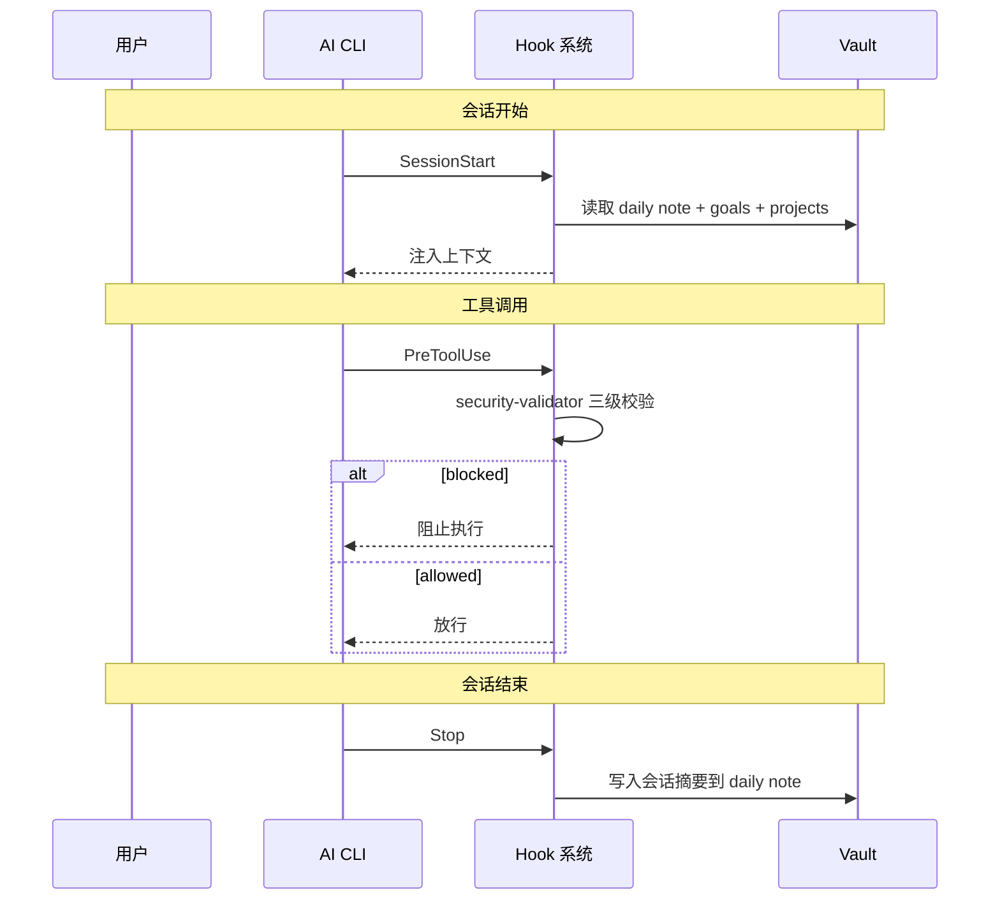

中文 | [English](README.md)

# telos — 个人 AI 身份系统

> 一套结构化框架，让你的 AI 助手在多个 CLI 工具之间保持一致的上下文。

## telos 是什么？

telos 是基于 Obsidian vault（或任何纯文本文件夹）的个人 AI 基础设施模板。它为你的 AI CLI 工具 — Claude Code、Gemini CLI、opencode、Codex CLI — 提供持久化的上下文：你是谁、在做什么、如何做决策。

```
没有 telos：  每次会话 → 从零开始 → 重复解释 → 低效
有了 telos：  每次会话 → 自动加载身份/目标/记忆 → 直接进入工作状态
```

核心理念很简单：AI 不应该是无状态的。你的时间和上下文很宝贵。telos 把通用 AI CLI 变成理解你的世界的搭档。

---

## 设计思想

借鉴 PAI（Personal AI Infrastructure）方法论，用 Obsidian + Git + Shell 脚本实现：

1. **单一真相源** — 一个 Git 仓库 = Obsidian vault = AI 配置中心
2. **身份即配置** — 你的职业定位、决策原则不是散落的笔记，而是 AI 每次启动时加载的系统指令
3. **记忆分层** — 热/温/冷三层记忆，不同生命周期，不同沉淀机制
4. **多 CLI 统一** — 一套源文件，通过 sync.sh 生成各 CLI 的配置格式
5. **安全优先** — 三级安全校验拦截危险操作，关键路径硬性阻断

---

## 功能一览

- **身份系统** — 持久化的信念、目标、策略和思维模型
- **三层记忆** — 热（会话）→ 温（日志）→ 冷（身份），自动沉淀
- **会话日志** — 自动生成每日笔记和每周回顾
- **安全围栏** — 基于 hook 的可配置命令校验（blocked/confirm/alert 三级）
- **多 CLI 支持** — Claude Code、Gemini CLI、opencode、Codex CLI
- **斜杠命令** — daily-log、weekly-review、decision-helper、knowledge-capture 等
- **Hook 系统** — 会话生命周期、安全校验、通知

---

## 架构总览



---

## 快速开始

### 前置条件

- 至少一个 AI CLI 工具（Claude Code / Gemini CLI / opencode / Codex CLI）
- Git
- 可选：Obsidian 1.12+（增强体验，非必需）

### 1. 克隆

```bash
git clone https://github.com/<your-username>/telos-template.git ~/Documents/Obsidian\ Vault
cd ~/Documents/Obsidian\ Vault
```

### 2. 初始化

```bash
bash setup.sh
```

交互式引导分两个阶段：

- **阶段一（基础配置）**：名字、角色、语言、路径、CLI 选择（约 1 分钟）
- **阶段二（身份定义）**：职位、目标、能力、使命、挑战、项目（可选，约 2 分钟）

阶段二的每一步都可以直接回车跳过，稍后手动编辑 `_telos/` 文件补充。

自动化/CI 环境：

```bash
bash setup.sh --non-interactive
```

### 3. 开始使用

```bash
claude   # Claude Code 会自动加载你的 telos 上下文
gemini   # Gemini CLI 同样支持
```

---

## 核心系统

### TELOS 身份系统（`_telos/`）

TELOS 回答一个根本问题：**AI 应该以什么身份、什么原则、什么目标来辅助你？**

```
_telos/
├── identity.md      # 你是谁：职业定位、核心能力、职业轨迹
├── mission.md       # 使命与愿景：北极星方向
├── goals.md         # 当前 OKR：按季度更新的具体目标
├── beliefs.md       # 决策原则：核心信条，AI 做决策时的依据
├── models.md        # 思维模型：常用模型，decision-helper 引用
├── strategies.md    # 策略方法：当前阶段的行动策略
├── projects.md      # 项目状态：所有活跃项目的追踪
├── worklog.md       # 工作追踪：进行中和待启动的工作项
├── lessons.md       # 踩坑记录：持续追加，weekly-review 自动提炼
├── challenges.md    # 当前挑战：定期审视，解决或接受
└── ideas.md         # 想法收集箱
```

设计逻辑：

- 每个文件只关注一个维度，遵循原子化原则
- 文件之间通过 Obsidian `[[wikilink]]` 互相引用，形成知识网络
- `identity.md` 是根节点，其他文件围绕它展开
- AI 启动时加载摘要，需要深度信息时按需读取完整文件

### 三层记忆系统



| 层级 | 载体 | 生命周期 | 写入方式 | 读取方式 |
|------|------|----------|---------|---------|
| 热 | AI 会话上下文 | 单次会话 | 自然对话 | 即时可用 |
| 温 | `_journal/` daily/weekly | 日/周 | hook 自动写入 + `/daily-log` | session-start 加载今日日志 |
| 冷 | `_telos/` + `knowledge/` | 长期 | `/weekly-review` 提炼 + 手动更新 | session-start 加载摘要 |

### 多 CLI 配置中心（`_agents/`）

一套源文件，通过 `sync.sh` 自动生成各 CLI 的配置格式：



`sync.sh` 子命令：

| 命令 | 功能 |
|------|------|
| `generate` | 从源文件拼接生成各 CLI 的配置文件 |
| `link` | 创建 symlinks（skills、commands、hooks） |
| `verify` | 健康检查（symlink 完整性、配置一致性） |
| `all` | 备份 → 生成 → 链接 → 验证（一键完成） |

### Hook 系统

Hook 在 AI 会话的关键节点自动触发动作：



### 安全系统

`security-patterns.yaml` 定义三级安全规则：

```yaml
blocked:   # 硬性阻断，无法绕过
  - "rm -rf /"
  - "rm -rf ~"
  - "gh repo delete"

confirm:   # 需要用户确认
  - "git push --force"
  - "git reset --hard"

alert:     # 记录告警
  - "curl|sh"
```

---

## 支持的 AI CLI

| CLI | 配置文件 | 命令 | Hooks | Skills |
|-----|---------|------|-------|--------|
| Claude Code | `~/.claude/CLAUDE.md` | .md | shell hooks | symlink |
| Gemini CLI | `~/.gemini/GEMINI.md` | .toml（自动转换） | shell hooks | auto-discover |
| opencode | `~/.config/opencode/AGENTS.md` | .md | JS plugin | auto-discover |
| Codex CLI | `~/.codex/AGENTS.md` | — | — | symlink |

---

## 目录结构

```
telos-template/
├── _telos/                    # 身份系统（你是谁）
│   ├── identity.md            # 角色、能力、职业轨迹
│   ├── mission.md             # 使命、愿景、北极星
│   ├── beliefs.md             # 决策原则、工作方式
│   ├── goals.md               # OKR 风格目标
│   ├── projects.md            # 活跃项目清单
│   ├── worklog.md             # 进行中 / 已完成 / 排队中
│   ├── lessons.md             # 经验教训和根因分析
│   ├── challenges.md          # 当前障碍
│   ├── strategies.md          # 行动策略
│   ├── models.md              # 思维模型和框架
│   └── ideas.md               # 想法收集箱
├── _agents/                   # AI CLI 配置
│   ├── identity.md            # 生成的 CLI 身份文件
│   ├── instructions/          # CLI 专属指令
│   │   ├── shared.md          # 所有 CLI 共享
│   │   ├── claude-specific.md
│   │   ├── gemini-specific.md
│   │   └── opencode-specific.md
│   ├── commands/              # 斜杠命令
│   ├── hooks/                 # Hook 框架
│   │   ├── adapters/          # CLI 适配器
│   │   └── lib/               # 共享库
│   ├── skills/                # 社区技能（按需安装）
│   ├── security-patterns.yaml # 安全规则
│   ├── config.env             # 用户配置
│   └── sync.sh                # 同步脚本
├── _journal/                  # 日记和周报
│   ├── daily/
│   └── weekly/
├── work/                      # 工作目录
│   ├── personal/
│   └── company/
├── knowledge/                 # 知识库
├── attachments/               # 图片和附件
├── setup.sh                   # 交互式初始化脚本
├── README.md
├── .gitignore
└── LICENSE
```

---

## 自定义

### 编辑身份

所有个人上下文在 `_telos/` 目录。直接编辑 Markdown 文件，然后运行 `_agents/sync.sh all` 同步到各 CLI 配置。

### 添加命令

在 `_agents/commands/` 创建 `.md` 文件，运行 `_agents/sync.sh link` 注册到各 CLI。

### 添加技能

将社区技能安装到 `_agents/skills/`，运行 `_agents/sync.sh link`。

### 多设备同步

```bash
# 新设备部署
git clone <your-repo> "Obsidian Vault"
cd "Obsidian Vault" && bash setup.sh
```

用 Git 同步。推荐配合 Obsidian 的 obsidian-git 插件实现自动同步。

---

## 常见问题

**Q: 需要 Obsidian 吗？**
A: 不需要。telos 作为纯文件系统也能工作。Obsidian 提供图谱视图、反向链接和 CLI 集成等增强体验，但不是必需的。

**Q: 不装任何 AI CLI 能用吗？**
A: `_telos/` 身份系统可以独立作为个人知识库使用。`_agents/` 集成需要至少一个支持的 AI CLI。

**Q: 数据会上传吗？**
A: 不会。telos 完全本地运行。身份文件由本地 AI CLI 工具读取，除非你主动推送到远程 Git 仓库，否则不会有任何数据离开本机。

---

## 设计决策

**为什么用 Obsidian 而不是数据库？** Markdown 是最持久的格式，不依赖特定工具。Git 版本控制 = 免费的时间机器。

**为什么 `_agents/` 和 `_telos/` 分开？** `_telos/` 是内容（你是谁），`_agents/` 是基础设施（如何送达 AI CLI）。分离关注点，改身份不需要动配置。

**为什么 Hook 用 Shell？** 启动速度 < 100ms，零额外依赖，逻辑本质上就是"读文件 → 拼字符串 → 输出"。

---

## 理念

telos 遵循 PAI（Personal AI Infrastructure）方法：

- **上下文为王** — 没有你的上下文，AI 只是一个花哨的自动补全
- **单一真相源** — 在 `_telos/` 定义一次，`sync.sh` 分发到所有 CLI
- **安全默认** — Hook 在执行前校验命令，你控制 AI 能做什么和不能做什么
- **纯文本，版本控制** — 全部是 Markdown 和 Shell 脚本，没有数据库，没有云服务，没有锁定

## 许可证

MIT
